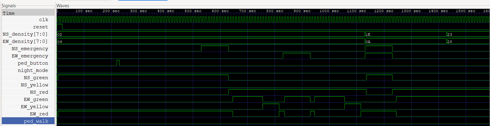

# 🚦 Intelligent Traffic Light Controller

An adaptive, modular digital hardware system designed and verified using **Verilog HDL**. This controller replaces primitive fixed-timer systems with dynamic, real-time sensing capabilities—incorporating adaptive traffic density timing, emergency vehicle routing, pedestrian handling, and an energy-efficient night mode.

---

## 📌 Project Overview
The goal of this project is to model an optimized, production-ready traffic management hub using a hierarchical structural architecture. The system actively processes road conditions (sensor data) to maximize traffic throughput and minimize intersection wait times.

### Key Features
* 📊 **Density-Based Timing:** Dynamically calculates green light intervals (10s to 60s) based on actual vehicle queues.
* 🚑 **Emergency Vehicle Priority:** Automatically overrides standard cycles to open corridors for emergency vehicles, resolving simultaneous requests by checking queue density.
* 🚶 **Pedestrian Crossing System:** Latches pedestrian requests via a dedicated latch controller, inserting a safe walking phase (`PED_WALK`) at the end of the full cycle.
* 🌙 **Night Mode Operation:** Suspends normal state sequencing to flash warning yellow signals on all routes via a structural hardware clock divider.
* ⚡ **Rigorous Functional Verification:** Validated through an extensive testbench covering overlapping asynchronous event triggers.

---

## 🏗️ Module Breakdown

The design utilizes a **hierarchical and modular approach**, dividing tasks among specialized compute blocks and an isolated Finite State Machine (FSM) control engine.

* **`intelligent_traffic_controller`**: The top-level wrapper managing internal net routing and structural module instantiations.
* **`Traffic_fsm`**: The central controller governing state transitions based on timer statuses, emergency flags, and mode inputs.
* **`timer`**: A hardware countdown block handling precise delay generation based on dynamically injected durations.
* **`density_processor`**: A combinational look-up matrix that maps calculated vehicle counts to optimal phase delays.
* **`emergency`**: A prioritize-and-route matrix dealing with active emergency overrides and density arbitration.
* **`pedestrian_controller`**: A sequential event-catcher ensuring pedestrian requests are latched and safely retained until serviced.
* **`light_output_decoder`**: Maps current state vectors directly to standard driver signals while incorporating an active pulse-width toggled blink routine for low-power operation.

---

## 🚦 Finite State Machine (FSM) Specification

The engine relies on a robust Moore-type FSM containing 9 structural operational states.

| State Metric | Hex Value | Active Output Mapping | Exit Trigger Condition |
| :--- | :---: | :--- | :--- |
| **`NS_G`** | `4'b0000` | North-South Green, East-West Red | `done` (Dynamic Density Time) |
| **`NS_Y`** | `4'b0001` | North-South Yellow, East-West Red | `done` (Fixed 5s Time) |
| **`ALL_R1`** | `4'b0010` | North-South Red, East-West Red | `done` (Fixed 2s Clearance) |
| **`EW_G`** | `4'b0011` | North-South Red, East-West Green | `done` (Dynamic Density Time) |
| **`EW_Y`** | `4'b0100` | North-South Red, East-West Yellow | `done` (Fixed 5s Time) |
| **`ALL_R2`** | `4'b0101` | North-South Red, East-West Red | `done` $\rightarrow$ Branch to `PED_WALK` or `NS_G` |
| **`PED_WALK`**| `4'b0110` | All Routes Red, Pedestrian Walk High | `done` (Fixed 15s Walk Time) |
| **`EMERGENCY`**| `4'b0111`| Priority Route Green, Blocked Route Red | `!emergency_present` (Asynchronous Release) |
| **`NIGHT`** | `4'b1000` | Synchronous Blinking Yellow Signals | `!night_mode` |

### Adaptive Density Mapping Logic
The `density_processor` adjusts timing dynamically using the following combinational bounds:
* **Density $\le$ 5:** Green Time = **10s**
* **Density $\le$ 15:** Green Time = **20s**
* **Density $\le$ 30:** Green Time = **40s**
* **Density $>$ 30:** Green Time = **60s**

---

## 💻 Simulation & Verification Strategy

The design has been validated through a high-coverage testbench (`tb`) focusing on asynchronous system events and corner-case stress testing.

### Test Matrix Profile
The simulation environment forces the hardware through several core operational scenarios:
1. **Standard Sequence Loop:** Runs a full pipeline cycle under low vehicle density conditions.
2. **Pedestrian Latching & Servicing:** Inserts an arbitrary pedestrian request button press during active vehicle windows and tests safe phase transitions.
3. **Emergency Disruption & Arbitration:** * Triggers individual North-South and East-West emergency overrides.
   * Simulates dual simultaneous emergency requests to verify state arbitration behavior based on competing vehicle queues.
4. **Dynamic Density Alteration:** Modifies traffic density registers mid-cycle to prove that the system recalculates timings live.
5. **Night Mode Entry/Exit:** Forces immediate suspension of the loop to run blinking patterns, returning cleanly to clearance cycles upon exit.

### How to Run Simulation Locally
Ensure you have an HDL compiler (such as **Icarus Verilog**) and a waveform viewer (**GTKWave**) installed.

```bash
# Clone the repository
git clone [https://github.com/DebanjonDas/intelligent-traffic-controller.git](https://github.com/yourusername/intelligent-traffic-controller.git)
cd intelligent-traffic-controller

# Compile the source files and testbench
iverilog -o traffic_sim intelligent_traffic_controller.v

# Run the simulation executable to generate VCD dumps
vvp traffic_sim

# Launch wave viewer to inspect signals
gtkwave traffic.vcd
```
## 📊 Simulation & Architecture Gallery

Below are the compiled state routing configurations alongside functional verification waveforms generated via GTKWave.

### Functional Waveform Verification


### Architectural Design Structures
This section captures the RTL architectural topologies and block interactions mapped across your design phases.

| Pipeline Block Diagrams (1–4) | Pipeline Block Diagrams (5–7) |
| :---: | :---: |
|  |  |
|  |  |
|  |  |
|  | *End of architectural layouts* |

### Test Suite Simulation Outputs
Live compilation terminal printouts detailing state transitions, emergency overrides, and verification success logs.

| Verification Logs | Log Overview Profiles |
| :---: | :--- |
|  | Full test suite initialization and baseline loops. |
|  | Pedestrian latch processing and emergency routing checks. |
|  | Simultaneous density stress test and safe exit verification. |
